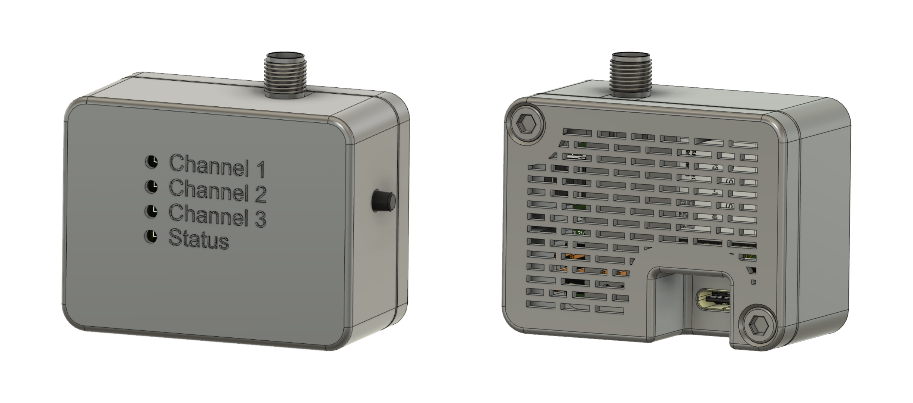
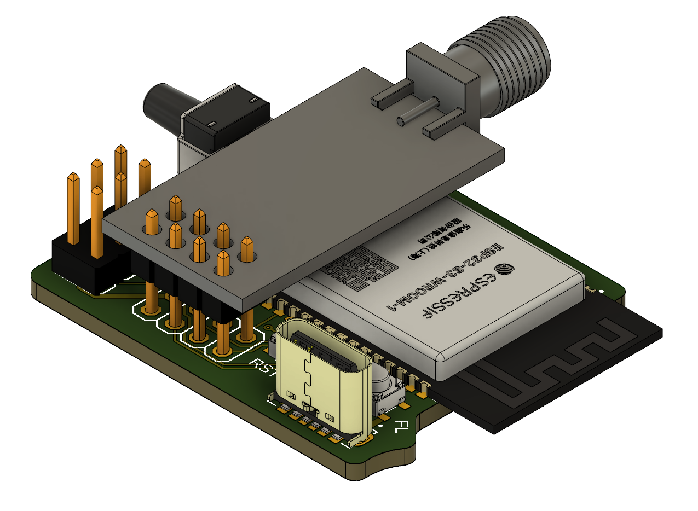
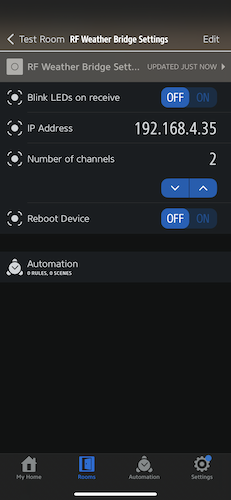

# esp32-homekit-rf-weather

[](https://github.com/oleksiikutuzov/esp32-homekit-rf-weather/actions/workflows/build.yml)   [](https://github.com/oleksiikutuzov/esp32-homekit-rf-weather/actions/workflows/lint.yml)



The software is based on [HomeSpan](https://github.com/HomeSpan/HomeSpan) and [RTL_433_ESP](https://github.com/NorthernMan54/rtl_433_ESP) libraries.

> **Warning**
> Don't expect any warranties. I am just a hobbyist, not a professional. It works for me, but you take your own risk using it. I am not liable for any damage to your devices.

## Hardware requirements

1. [Custom PCB](https://github.com/oleksiikutuzov/esp32-homekit-rf-weather/tree/main/PCB) (BOM inside) from this project 
   
   or 
   
   any ESP32 Dev board e.g. [ESP32-DevKitC V4 board](https://docs.espressif.com/projects/esp-idf/en/latest/esp32/hw-reference/esp32/get-started-devkitc.html)
2. [E07-M1101D](https://manuals.plus/ebyte/e07-m1101d-sma-cc1101-433mhz-dip-wireless-module-manual#axzz7j0rVAbnv) 433 MHz Wireless module 

## Pinout

### Wireless module pins

If you are using a dev board, you will need to connect the wireless module to some specific pins of ESP32.

```
ESP32          Module
---------------------
GPIO18         SCK
GPIO19         MISO
GPIO23         MOSI
GPIO5          CS
GPIO22         GDO0
GPIO4          GDO2
```

### LEDs and control button pins

If you are using a dev board, you can utilize any pins you want or not use them at all. There is a control button to be able to reset the device, WIFI or HomeKit configuration. The status pin shows the current state of the device. More info on the status LED and control button is in [HomeSpan User](https://github.com/HomeSpan/HomeSpan/blob/master/docs/UserGuide.md) Guide](https://github.com/HomeSpan/HomeSpan/blob/master/docs/UserGuide.md). Three additional LEDs are blinking on the received signal on any of the channels. To redefine the pins for the dev board edit the following in the sketch:
```C++
#ifdef DEV_BOARD
	#define LED_CH1    13
	#define LED_CH2    21
	#define LED_CH3    17
	#define LED_STATUS 16
	#define BUTTON_PIN 15
```


## How to setup and install

1. Install [PlatformIO Core](https://platformio.org/install/cli) and [VSCode Plugin](https://docs.platformio.org/page/ide/vscode.html) (setup I am using and tested the instructions on) or [PlatformIO IDE](https://platformio.org/install/ide) with built-in Core.
2. Clone this repository
In the `platformio.ini` file set the default environment to `esp32_dev_board` or `esp32_custom_pcb` depending on the board you are using.
   ```
   [platformio]
   default_envs = esp32_custom_pcb
   ```
4. Build the firmware with a dedicated button in the PlatformIO extension or with the command 
   ```
   pio run
   ```
5. Upload the firmware with a dedicated button in the PlatformIO extension or with the command 
   ```
   pio run --target upload
   ```
6. You can monitor the serial output to check everything is working as intended with a dedicated button in the PlatformIO extension or with the command
   ```
   pio run --target monitor
   ```

## Custom Hardware

Custom PCB is designed for the project. Currently for regular ESP32 boards.



## Connect to HomeKit

1. Plug your LED Controller to power
2. The access point should start automatically. Later you can manually enter configuration mode (More on [HomeSpan User Guide](https://github.com/HomeSpan/HomeSpan/blob/master/docs/UserGuide.md))
3. Go to WiFi settings on your iPhone/iPad and connect to the "HomeSpan-Setup" WiFi network
4. You will choose your WiFi network and set the setup code for the accessory
5. Go to your Home app and select "Add Accessory"
6. Select "More Options" and you should see your RF Weather Bridge there
## Settings and controls

When adding to HomeKit it will add the unsupported device called **RF Weather Bridge Settings** with device settings (3rd party apps like Eve support this and can be used for configuration). Available custom characteristics:
1. Toggle whether to blink the LEDs on receive
2. Showing the IP address the device is connected to
Set the number of channels, on which you want to receive (created an accessory for each channel). Can be set as 1 to 3
4. Toggle to reboot the device (to reload the device if you change the number of channels)



The device will throw a Status Fault in Eve app if there are no sensor updates for 5 minutes. 

Characteristics values are saved to NVS, so they will be restored if the device loses power. 

The web server update was implemented. You can flash binary at `http://[DEVICE IP]/update`.
There is a reboot link. Opening `http://[DEVICE IP]/reboot` will force the device to reboot. 

The device can also be controlled by the button on the board. More on [HomeSpan User Guide](https://github.com/HomeSpan/HomeSpan/blob/master/docs/UserGuide.md)

## TODO
### PCB:
- [ ] Add a USB-to-Serial converter to the board
- [ ] Make more space for flashing pin headers

## References and sources

- @HomeSpan for ESP32 HomeKit firmware [GitHub link](https://github.com/HomeSpan/HomeSpan)
- @NorthernMan54 for rtl_433_ESP library [GitHub link](https://github.com/NorthernMan54/rtl_433_ESP)

Although already forbidden by the sources and subsequent licensing, it is not allowed to use or distribute this software for commercial purposes.<br/><br/>

 

###### HomeKit Accessory Protocol (HAP) is Apple’s proprietary protocol that enables third-party accessories in the home (e.g., lights, thermostats and door locks) and Apple products to communicate with each other. HAP supports two transports, IP and Bluetooth LE. The information provided in the HomeKit Accessory Protocol Specification (Non-Commercial Version) describes how to implement HAP in an accessory that you create for non-commercial use and that will not be distributed or sold.

###### The HomeKit Accessory Protocol Specification (Non-Commercial Version) can be downloaded from the [HomeKit Apple Developer page.](https://developer.apple.com/homekit/)

###### Copyright © 2019 Apple Inc. All rights reserved.